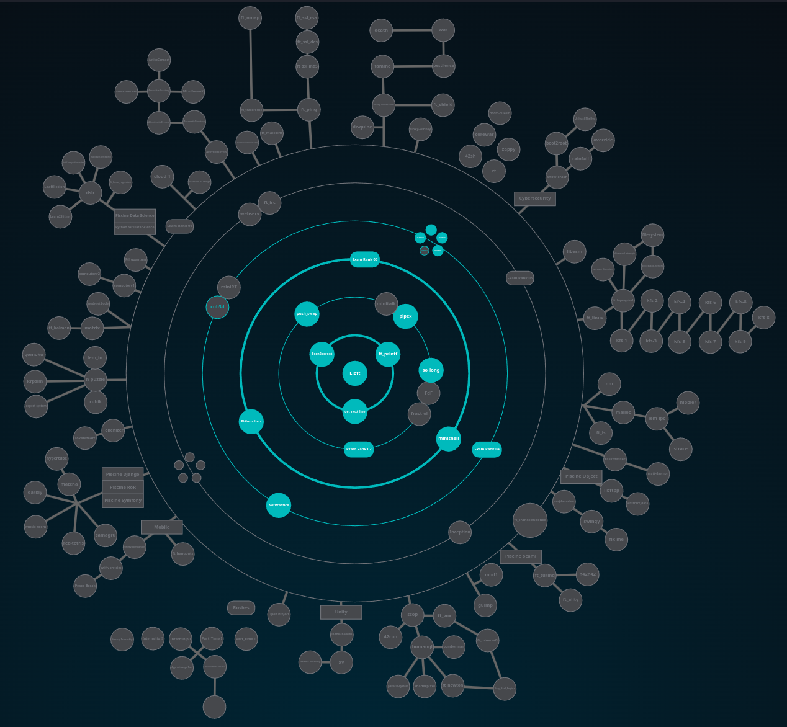

## Cursus 42Madrid

This is my current progress on the 42Madrid Cursus

| **Project**                                        | **Description** | **Score**   | **Languaje** |
| -------------------------------------------------- | --------------- | ----------- | ------------ |
| [libft](/lvl0/Libft)                               | Library of C functions                                   | **125/100**     |                      |
| [ft_printf](/lvl1/printf)                          | Function to write something in the standard output       | **100/100**     |                      |
| [get_next_line](/lvl1/get_next_line)               | Function to read the next line of a file descriptor      | **125/100**     |                      |
| [Born2beroot](/lvl1/Born2beRoot)                   | Creation of a Virtual Machine in VirtualBox              | **125/100**     |                      |
| [Push_Swap](/lvl2/push_swap)                       | Program to sort numbers with a sorting algorithm         | **125/100**     |                      |
| [Pipex](/lvl2/pipex)                               | Program to execute two commands linking them with a pipe | **125/100**     |                      |
| [So_Long](/lvl2/so_long)                           | Interative 2D Grame                                      | **125/100**     |                      |
| [Exam Rank 02](/lvl2/exam_rank_02)                 | C functions exam                                         | **100/100**     |                      |
| [Philosophers](/lvl3/Philosophers)                 | Simulation using threads                                 | **108/100**     |                      |
| [Minishell](https://github.com/BishopVK/minishell) | Bash Like Terminal in C                                  | **101/125**     |                      |
| [Exam Rank 03](/lvl3/exam_rank_03)                 | Reduced printf exam                                      | **100/100**     |                      |
| [CPP Module (00 to 04)](/lvl4/CPP_Module)          | C++ Programs                                             | **500/500**     |    |
| [NetPractice](/lvl4/NetPractice)                   | Networking Connection Simulation                         | **100/100**     |            |
| [Cub3D](https://github.com/BishopVK/Cub3D)         | Wolfestein Like 3D Game                                  | **110/125**     |                      |
| [Exam Rank 04](/lvl4/exam_rank_04)                 | Mini bash exam                                           | **100/100**     |                      |
| [CPP Module (05 to 09)](/lvl5/CPP_Module)          | C++ Programs                                             | **500/500**     |    |
| [Inception](https://github.com/BishopVK/Inception) | Docker Containers with Docker Compose run by a Makefile  | **100/100**     |  |
| [webserv](https://github.com/BishopVK/Webserv)     | Create our own HTTP server                               | **100/100**     |  |
| [Exam Rank 05](/lvl5/exam_rank_05)                 | C++ exam                                                 | **100/100**     |                      |
| [ft_transcendence](#)                 | Multiplayer gaming web platform with authentication and chat         | **In Progress**     |                      |
| [Exam Rank 06](/lvl6/exam_rank_06)                 | Basic non-blocking chat server using select and socket programming in C | **100/100**     |  |