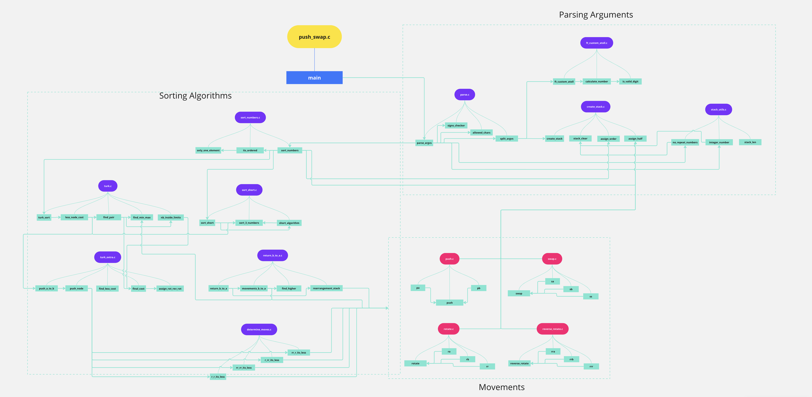
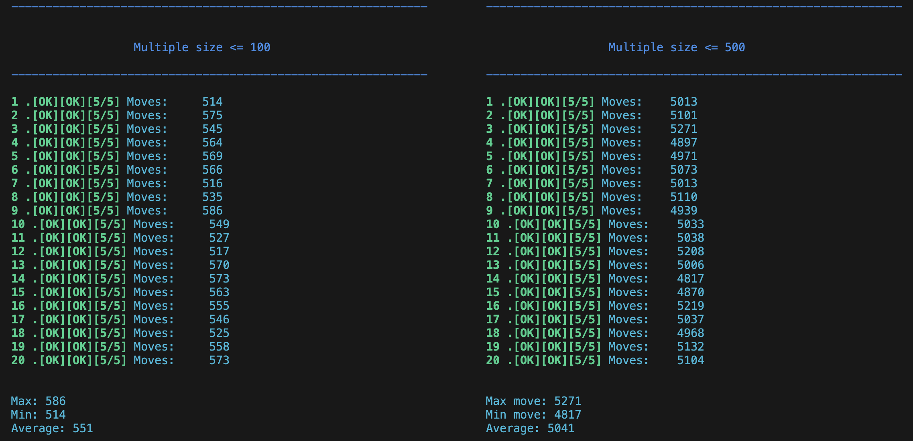

## Grade

| **Score**           | **Description**     |
|-----------------------|---------------|
| <p align="center"></p> | **Mandatory part + Bonus part**   |

---

## push_swap

This project will make you sort data on a stack, with a limited set of instructions, using the lowest possible number of actions. To succeed you’ll have to manipulate various types of algorithms and choose the most appropriate solution (out of many) for an optimized data sorting.

### 📌 Algorithm

The sorting logic is inspired by the **Turkish algorithm**, a highly efficient partitioning strategy for this type of problem. It is based on the implementation and explanation by **A. Yigit Ogun** published on Medium. You can read the original post [here](https://medium.com/@ayogun/push-swap-c1f5d2d41e97).

---

## Instruction set

For the following instructions, if the instruction is not possible, the part of
it that can't be executed won't.

| Code  | Instruction                         | Action                                                 |
| ----- | ----------------------------------- | ------------------------------------------------------ |
| `sa`  | swap a                              | swaps the 2 top elements of stack a                    |
| `sb`  | swap b                              | swaps the 2 top elements of stack b                    |
| `ss`  | swap a + swap b                     | both `sa` and `sb`                                     |
| `pa`  | push a                              | moves the top element of stack b at the top of stack a |
| `pb`  | push b                              | moves the top element of stack a at the top of stack b |
| `ra`  | rotate a                            | shifts all elements of stack a from bottom to top      |
| `rb`  | rotate b                            | shifts all elements of stack b from bottom to top      |
| `rr`  | rotate a + rotate b                 | both `ra` and `rb`                                     |
| `rra` | reverse rotate a                    | shifts all elements of stack a from top to bottom      |
| `rrb` | reverse rotate b                    | shifts all elements of stack b from top to bottom      |
| `rrr` | reverse rotate a + reverse rotate b | both `rra` and `rrb`                                   |

---

## push_swap live

<p align="center">

</p>

---

## Flowchart

<p>In the flow chart you will be able to see the flow of the program, and the logic that follows from the beginning to the end, from the parse of the data to the choice of the algorithm according to the number of elements and their own execution.</p>
<p>You can see it <a target="_blank" href="https://miro.com/welcomeonboard/dXZvNFVMbkNGakxyZ3JQdzZsYlNyQ0tkNUtqMEg5Y1MwUjdtSUFPVm5OSlRUUXNBS3A3V2dxRklOM1dtODg2TnwzNDU4NzY0NTg0MTgxMDc2MTY0fDI=?share_link_id=798564080102">here.</a></p>

<p align="center">

</p>

---

## Test Grade

<p>The scoring criteria for the ranges of 100 and 500 numbers are as follows:</p>

|  `100 numbers`        ||    `500 numbers`          ||
|:------------:|------|:------------:|------|
|   MOVES   |   SCORE   |    MOVES    |   SCORE   |
|   < 700    |    `5`    |   < 5500    |    `5`    |
|   < 900    |    `4`    |   < 7000    |    `4`    |
|  < 1100   |    `3`    |   < 8500    |    `3`    |
|  < 1300   |    `2`    |  < 10000   |    `2`    |
|  < 1500   |    `1`    |  < 11500   |    `1`    |


<p align="center">

</p>

---

## 🧪 Bonus Part: checker

As part of the bonus, a custom **checker** program was developed to verify the correctness of the instructions output by `push_swap`.

### ✅ Description

The `checker` program reads a sequence of instructions and applies them to the initial stack. If after all operations stack **a** is sorted and stack **b** is empty, it prints:

```
OK
```

Otherwise:

```
KO
```

In case of error (invalid arguments or instructions), it prints:

```
Error
```

### ⚙️ Features

- Verifies the correctness of the instruction list.
- Handles input errors such as:
  - Non-integer values
  - Integer overflows
  - Duplicated values
  - Invalid instructions
- Built using `read`, `write`, `malloc`, `free`, and `exit`.
- Compatible with custom `ft_printf` and functions from the **libft**.

### 🧾 Example Usage

```bash
$> ./checker 3 2 1 0
rra
pb
sa
rra
pa
^D
OK

$> ./checker 3 2 1 0
sa
rra
pb
^D
KO

$> ./checker 3 2 one 0
Error

$> ./checker "" 1
Error
```

---

## 🛠️ Makefile

For mandatory part:

```bash
make
```

For checker and other bonus functionalities:

```bash
make bonus
```