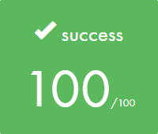

## Grade

| **Score** | **Description** |
|---|---|
| 

 | **Full project** |

## CPP Module 08: Templated containers, iterators, algorithms

This module focuses on templated containers, iterators, and algorithms, allowing the use of the Standard Template Library (STL). 

### Exercises

* **[Exercise 00: Easy find](./ex00)**
    * This exercise requires writing a function template named `easyfind` that accepts a type `T` (assumed to be a container of integers). It takes two parameters: the first is of type `T`, and the second is an integer. The function must find the first occurrence of the second parameter in the first parameter. If no occurrence is found, it should either throw an exception or return an error value of choice.
* **[Exercise 01: Span](./ex01)**
    * This exercise involves developing a `Span` class that can store a maximum of `N` integers, where `N` is an unsigned integer passed to the constructor. The class must have an `addNumber()` member function to add a single number, which throws an exception if `N` elements are already stored. Additionally, `shortestSpan()` and `longestSpan()` member functions must be implemented to find the shortest and longest distances between stored numbers, respectively, throwing an exception if no numbers or only one number is stored.
* **[Exercise 02: Mutated abomination](./ex02)**
    * This exercise focuses on implementing a `MutantStack` class that inherits from `std::stack` but provides public iterators (like `begin()` and `end()`) to access and iterate through its underlying container, demonstrating compatibility with standard algorithms.

### General Rules

* Code is compiled with `c++` and flags `-Wall -Wextra -Werror`.
* Code must compile with the `-std=c++98` flag.
* Class names are in UpperCamelCase.
* Output messages end with a newline character.
* The C++ standard library is allowed, but external libraries and certain C functions (`printf()`, `*alloc()`, `free()`) are forbidden.
* `using namespace <ns_name>` and `friend` keywords are forbidden unless explicitly stated.
* STL (containers, algorithms) is allowed in this module and Module 09.